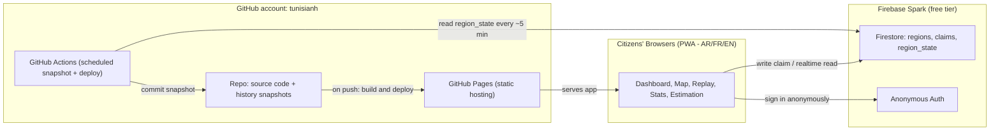
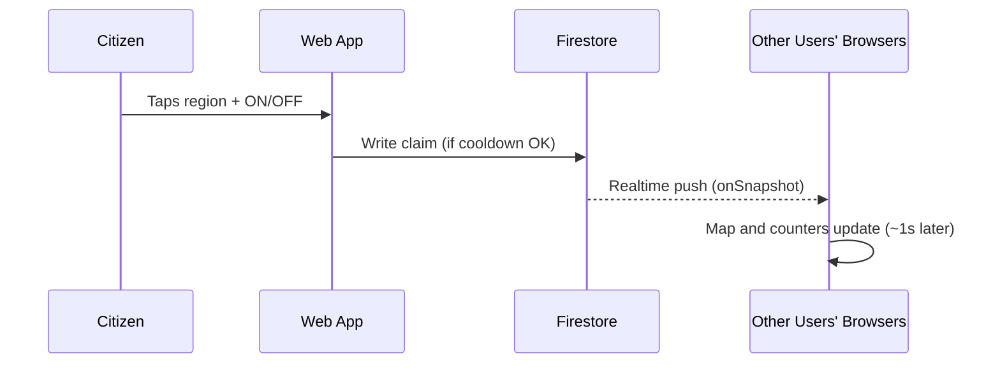
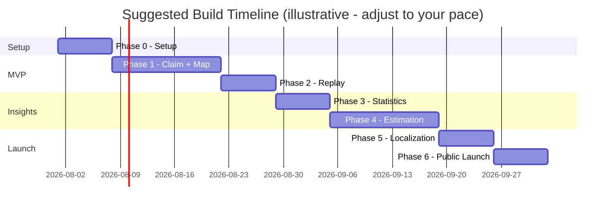

# ⚡ Kahraba Live — Tunisia Electricity Status Tracker
### A free, open-source, community-reported electricity outage map for Tunisia

**Document type:** Product & Technical Specification (living document — update as you build)
**Proposed GitHub home:** `tunisianh/kahraba-live` (public repo, GitHub Pages)
**Status:** Draft v1.0, pre-development
**Last updated:** July 23, 2026

> **How to use this document:** hand it to a developer, or to an AI coding assistant such as Claude Code, as the build spec. Sections 19 and 20 double as your progress tracker — check items off as they land. The free-tier numbers in Section 12 are approximate and providers do adjust them over time, so re-verify on each provider's pricing page before you launch.

---

## Table of Contents
1. [Executive Summary](#1-executive-summary)
2. [Context and Problem Statement](#2-context-and-problem-statement)
3. [Key Decisions vs the Original Brief](#3-key-decisions-vs-the-original-brief)
4. [Legal, Ethical and Data-Sourcing Foundations](#4-legal-ethical-and-data-sourcing-foundations)
5. [Goals and Non-Goals](#5-goals-and-non-goals)
6. [Personas and User Stories](#6-personas-and-user-stories)
7. [Feature Specification](#7-feature-specification)
8. [Localization (Arabic, French, English)](#8-localization-arabic-french-english)
9. [Data Model](#9-data-model)
10. [System Architecture](#10-system-architecture)
11. [Tech Stack](#11-tech-stack)
12. [Free-Tier Budget and Scaling Notes](#12-free-tier-budget-and-scaling-notes)
13. [Estimation and Forecasting Algorithm](#13-estimation-and-forecasting-algorithm)
14. [Anti-Abuse and Data Integrity](#14-anti-abuse-and-data-integrity)
15. [Accessibility and Performance](#15-accessibility-and-performance)
16. [Licensing, Attribution and Disclaimers](#16-licensing-attribution-and-disclaimers)
17. [Repository Structure](#17-repository-structure)
18. [Deployment Guide](#18-deployment-guide)
19. [Development Roadmap and Progress Tracker](#19-development-roadmap-and-progress-tracker)
20. [Detailed Task Backlog](#20-detailed-task-backlog)
21. [Success Metrics (KPIs)](#21-success-metrics-kpis)
22. [Risks and Mitigations](#22-risks-and-mitigations)
23. [Contribution Guide](#23-contribution-guide)
24. [Appendix A — Tunisia's 24 Governorates](#appendix-a--tunisias-24-governorates)
25. [Appendix B — Trilingual UI Glossary](#appendix-b--trilingual-ui-glossary)

---

## 1. Executive Summary

Tunisia is in the middle of a real electricity capacity crisis: summer 2026 demand is running close to national production capacity, and STEG (Société Tunisienne de l'Électricité et du Gaz) has been running rotating outages ("délestage tournant") since mid-July. Citizens frequently report that STEG's official zone announcements don't match what they actually experience — some announced zones are spared, some unannounced zones get cut.

This document specifies **Kahraba Live**: a free, open-source, community-run web app where:
- Any Tunisian can report, in one tap, whether their governorate currently has electricity.
- Anyone can see a near-real-time map of the whole country, color-coded by reported status.
- Anyone can replay past states by date/time.
- Raw claim counts (not just a resolved yes/no) are published for transparency.
- A forecasting tab estimates near-future outage likelihood per region from historical patterns.
- The whole app is trilingual (Arabic / French / English) and works as an installable, offline-tolerant Progressive Web App.
- It runs at **$0/month**, entirely on free tiers, published under the `tunisianh` GitHub account.

Critically: **no part of this design scrapes any third-party website.** All live status data is submitted directly by Kahraba Live's own users, exactly like the reporting model of the independent citizen project it was inspired by (see Section 2).

---

## 2. Context and Problem Statement

- Tunisia's peak summer demand has approached roughly 5,000 MW against local production capacity of around 4,630 MW, with the gap partly covered by imports from Algeria — a genuine grid-capacity shortfall, not just a communications problem.
- STEG publishes daily communiqués naming governorates/delegations that may be affected, but many residents report mismatches on social media between announced and actual outages.
- An independent citizen project, **Famma Dhaw** (famma-dhaw.com — "is there light?" in Tunisian dialect), already responded to this exact gap: it's a volunteer-built, non-commercial, community-reported outage map covering roughly 296 zones, with a 10-minute per-zone reporting cooldown and a 45-minute freshness window on each report. It explicitly frames itself as unofficial, community data to be cross-checked against STEG's own communiqués.
- The existence of Famma Dhaw is good news for this project: it proves the crowdsourcing model works technically and that Tunisians will actually use a tool like this. It also means Kahraba Live needs a clear reason to exist alongside it (see Section 3 and 4.2) rather than just being a copy.

---

## 3. Key Decisions vs the Original Brief

The original brief assumed scraping famma-dhaw.com every second. Since you've ruled scraping out, here's how each requirement gets satisfied legally instead:

| Original ask | Why scraping isn't the answer | What we do instead |
|---|---|---|
| Scrape famma-dhaw.com for regional state | Its data is itself voluntarily submitted by *its* community, not an official feed. Copying it would repurpose other people's reports without consent — and automated scraping of a third-party site without permission is exactly what you asked to avoid. | Build our **own** independent self-reporting pipeline. Same proven model (residents tap "on"/"off"), our own users, our own data. |
| Refresh "every 1 second" | No server needs to be polled every second, and fixed-interval polling is the wrong tool once you control the data source yourself. | Use a realtime database (Firestore or Supabase) with push updates. The map updates within roughly a second of any new claim — event-driven, not a timer. |
| Publish on GitHub free tier | GitHub Pages is static hosting only — no server, no database. | Static frontend on GitHub Pages, a free-tier realtime backend for live data, and GitHub Actions (free and effectively unlimited on public repos) for scheduled snapshotting. |

> **Why this still delivers "real-time":** nothing about Tunisia's grid changes on a literal 1-second cadence — the state changes when STEG flips a switch, or when enough neighbors notice power is back. What actually matters is that *when someone reports*, everyone else sees it almost instantly. Realtime listeners deliver that; a 1-second polling loop against a scraped page would not have done it any better, and would have required exactly the scraping you want to avoid.

---

## 4. Legal, Ethical and Data-Sourcing Foundations

This section is the backbone of the project given your "no scraping, legal only" requirement.

### 4.1 Data-sourcing principle
- **100% of live status data comes from Kahraba Live's own users**, submitted voluntarily through the in-app Claim feature. Nothing is scraped, proxied, mirrored, or otherwise extracted from famma-dhaw.com, STEG, or any other site.
- If you ever want to show STEG's official communiqué alongside community reports (a nice transparency feature — "official said X, residents reported Y"), that entry must be **typed in manually by a maintainer** as a short paraphrase with a link to the original STEG post — never auto-scraped.
- Using OpenStreetMap's Overpass API to pull administrative boundary polygons, or fetching data from a humanitarian open-data catalog, is **not** scraping — these are public APIs and open datasets explicitly meant for exactly this kind of reuse. That's different in kind from extracting live content off someone's live website.

### 4.2 Relationship to Famma Dhaw
Famma Dhaw is an existing, independent, volunteer-run project solving a near-identical problem. Two legitimate paths forward — your call:

1. **Build independently.** Differentiate on trilingual UI, replay mode, open raw-count statistics, and forecasting — none of which the original appears to offer today. Use a **distinct name and visual identity** so users and press don't confuse the two projects.
2. **Reach out and collaborate.** Contact the Famma Dhaw team and propose contributing these features to their existing user base instead. Splitting Tunisia's pool of reporters across two competing apps dilutes both datasets' reliability — worth a message before investing weeks of solo work.

This spec assumes path 1 since that's what you asked to be scoped, but path 2 costs you one email and might save everyone duplicated effort.

**Do not reuse** the "Famma Dhaw" name, tagline, or visual identity for your own project — pick your own brand (see naming suggestions in Section 17).

### 4.3 Licensing and attribution
- App source code: **AGPL-3.0** is the natural fit for a non-profit, transparency-first community tool — it ensures that if anyone hosts a modified version of your app as a service, they must share their changes back too. **MIT** is a simpler alternative if you'd rather optimize for the widest possible reuse and lower friction for contributors. Pick one before your first commit.
- Map tiles/data: © OpenStreetMap contributors, ODbL license. Keep Leaflet's default attribution control visible — never remove it.
- Any STEG communiqué referenced: link + short paraphrase only, never a full repost of the text.

### 4.4 Privacy
- No user accounts, phone numbers, or e-mails. No precise GPS by default — users pick their governorate from a list or a map tap; precise geolocation is opt-in only, used solely to pre-select a region, never stored.
- Each browser gets an anonymous device ID (e.g., via Firebase Anonymous Auth) purely to enforce the reporting cooldown — not linked to any personal identity, never shared or sold.
- Publish a short, plain-language privacy note in all three languages before launch.

### 4.5 Anti-abuse and integrity
See Section 14 for detail. In short: a per-zone reporting cooldown, a freshness window after which old reports stop counting, and basic bot mitigation — the same shape of safeguards Famma Dhaw itself uses (10-minute cooldown, 45-minute freshness), which is a reasonable starting point to copy in spirit (not in code) and tune from your own usage data.

---

## 5. Goals and Non-Goals

**Goals**
- **G1:** Any resident can report their governorate's status in under 10 seconds, from a phone, in their language.
- **G2:** Anyone can see a near-real-time map of Tunisia colored by reported status.
- **G3:** Anyone can scrub back in time to see what the map looked like at a past date/time.
- **G4:** Publish raw claim counts (not just a resolved state) for full transparency.
- **G5:** Offer a forecast of near-future outage likelihood per region once enough history exists.
- **G6:** Run at $0/month indefinitely, on GitHub Pages plus a free-tier backend, with no ads and no data resale.
- **G7:** Be fully usable in Arabic (RTL), French, and English.

**Non-Goals (at least for v1)**
- **NG1:** Not an official STEG channel, and must never present itself as one.
- **NG2:** Not a scraper or mirror of any other outage-tracking site.
- **NG3:** Not a guarantee-grade forecast — the Estimation tab is explicitly probabilistic and labeled as such.
- **NG4:** Not delegation-level detail (finer than 24 governorates) initially — a stretch goal once the governorate-level MVP is solid.
- **NG5:** Not a STEG complaint/support channel — no ticketing, no contacting STEG on the user's behalf.

---

## 6. Personas and User Stories

**Personas**
- *Amira, 29, Tunis* — wants to know before leaving work whether her neighborhood's power is back.
- *Sami, 45, Sfax, shop owner* — glances at nearby regions to decide whether to run a backup generator.
- *Youssef, 34, diaspora in France* — checks on family in Kasserine remotely; prefers the French UI.
- *Amal, 22, Kairouan, student* — reports her dorm's status because she wants the map to be accurate for her neighbors.
- *A researcher or journalist* — wants the open statistics/export to write about outage patterns.

**User Stories**

*Dashboard and Map*
- **US-1:** As a visitor, I want to see a Tunisia map color-coded by current electricity status per governorate, so I can tell at a glance where's affected.
- **US-2:** As a visitor, I want to tap a governorate to see its detail (status, last update time, raw ON/OFF counts), so I can judge how reliable the reading is.
- **US-3:** As a visitor, I want the map to update without refreshing the page, so it stays current while I'm watching it.

*Claiming*
- **US-4:** As a resident, I want to report my region's status in one or two taps, so reporting is fast enough to actually do during a blackout.
- **US-5:** As a resident, I want to be told if I've reported recently and when I can report again, so I understand the cooldown instead of thinking the app is broken.
- **US-6:** As a resident, I want my report to be anonymous, so I don't need an account or to share personal data.

*Replay*
- **US-7:** As any user, I want to pick a past date and time and see the map as it looked then, so I can understand how an outage evolved.
- **US-8:** As any user, I want play/pause/scrub controls over a timeline, so I can watch an outage spread or resolve.

*Statistics*
- **US-9:** As any user, I want to see raw counts of "ON" vs "OFF" claims per region — not just one resolved label — so I can judge how contested or confident a reading is.
- **US-10:** As a researcher or journalist, I want to export aggregated (anonymized) data as CSV/JSON, so I can analyze it independently.
- **US-11:** As any user, I want to see 24h/7d/30d trends, so I can tell whether things are improving or worsening.

*Estimation*
- **US-12:** As a resident planning my day, I want to see an estimated outage likelihood for my region over the next few hours, so I can plan around it.
- **US-13:** As any user, I want the estimation to clearly state it's a probability, not a guarantee, and explain in plain language how it was derived, so I don't over-trust it.

*Localization*
- **US-14:** As an Arabic-speaking user, I want the whole app in Arabic with correct right-to-left layout, so it reads naturally.
- **US-15:** As any user, I want to switch language at any time without losing my place in the app.

*Trust and Transparency*
- **US-16:** As any user, I want a clear "community data, not an official STEG source" disclaimer, so I calibrate my trust correctly.

---

## 7. Feature Specification

### 7.1 Dashboard (Landing Page)
- Full-Tunisia Leaflet map on OSM tiles, governorates rendered as clickable GeoJSON polygons.
- Legend: green = reported ON, red = reported OFF, amber = mixed/contested signal, gray = no recent data. Color is always paired with an icon/label, never color alone (see Section 15).
- Header stats strip: total active reporters (last 45 minutes), regions affected / total, last update timestamp.
- Region click opens a side panel: current state, raw ON vs OFF counts, last few reports (relative time only, never identity), and a "Report here" button.
- Always-visible language switcher (AR/FR/EN); Arabic flips the entire layout to RTL.
- Installable as a PWA; last-known state is cached so it's viewable even on a flaky connection — common precisely when there's an outage nearby.

### 7.2 Claim Flow
1. User opens the app, or taps "Report" from anywhere in the UI.
2. Region is pre-filled from opt-in geolocation if granted, otherwise chosen from a searchable list or a map tap.
3. One tap: "⚡ Electricity ON" or "🚫 Electricity OFF."
4. Client checks local cooldown state first for a fast response, then the database enforces it authoritatively.
5. Success shows a toast and updates the local counters; a cooldown rejection shows the remaining wait time, in-language.

### 7.3 Replay Mode
- Date picker plus a time slider, bounded by the project's actual data history (starts empty at launch, grows daily).
- Playback controls: play, pause, step forward/back, and speed (1x / 4x / 10x).
- Powered by periodic snapshots (Section 10), not live queries — keeps this feature fast and fully within free-tier limits.

### 7.4 Statistics Tab
- Per-region raw ON vs OFF counts for the current window — the transparency feature you explicitly asked for.
- National affected/total ratio over time (line chart: 24h / 7d / 30d).
- Longest ongoing outage streaks (top 5 regions).
- Total reports today and all-time; total unique reporting devices as a rough engagement gauge.
- CSV/JSON export of aggregated (never per-user) data.

### 7.5 Estimation Tab
- Reuses the same map component as the Dashboard, but recolored to show a **predicted** outage probability for a selected future date/time window instead of the live state.
- Pick a region (or view the whole country) plus a future time horizon (next few hours to a few days).
- Legend switches to a probability gradient (e.g., light-to-dark = low-to-high likelihood) instead of the binary on/off legend, with a visible confidence / data-sufficiency indicator per region.
- A "How is this calculated?" panel explains the method in plain language (Section 13).
- Model accuracy is tracked over time and shown openly — a forecast nobody can audit isn't trustworthy on a project built around transparency.

---

## 8. Localization (Arabic, French, English)

- Use a standard i18n framework — `react-i18next` (or `vue-i18n` if you pick Vue) — with one JSON file per language, per the repository layout in Section 17.
- Arabic requires `dir="rtl"` at the document root when active, plus mirrored icons and layout — test this specifically, since it's the most commonly missed detail in trilingual apps.
- Store region names in all three languages directly in the data model (Section 9) rather than translating on the fly.
- Appendix B gives a starter glossary of key UI terms in all three languages — have a native Tunisian-dialect speaker review the Arabic before shipping, since dialect nuance matters and this list is only a starting draft.

---

## 9. Data Model

**`regions`** — static reference data, 24 documents, one per governorate.
```json
{
  "id": "kairouan",
  "name_ar": "القيروان",
  "name_fr": "Kairouan",
  "name_en": "Kairouan",
  "geo_center": [35.6781, 10.0963],
  "geojson_ref": "governorates.geojson#kairouan"
}
```

**`claims`** — append-only, one document per report.
```json
{
  "id": "auto",
  "region_id": "kairouan",
  "status": "on | off",
  "device_id": "anon-uid-from-auth",
  "created_at": "server timestamp",
  "source": "app"
}
```

**`region_state`** — derived/aggregated, one document per region, recomputed client-side (or by a scheduled job).
```json
{
  "region_id": "kairouan",
  "window_minutes": 45,
  "on_count": 8,
  "off_count": 3,
  "resolved_state": "on | off | mixed | unknown",
  "last_updated": "server timestamp"
}
```

**`history_snapshots`** — written roughly every 5 minutes by a GitHub Action, one JSON file per timestamp, committed to the repo to power Replay.
```json
{
  "ts": "2026-07-23T14:05:00Z",
  "regions": { "kairouan": "off", "tunis": "on" }
}
```

*(Use simple lowercase slugs as region IDs, as above, rather than inventing ISO codes from memory. If you want a standards-based identifier later, ISO 3166-2:TN codes exist for Tunisia's governorates — look them up directly rather than trusting a guess, since getting one digit wrong would silently corrupt your data model.)*

---

## 10. System Architecture





**Why this satisfies "real-time, every second" with no scraping and no paid server:** Firestore's realtime listeners push changes to every connected client the moment a write happens — there's no polling loop and no 1-second timer to babysit. The GitHub Actions job runs on a much slower cadence (every 5 minutes is plenty) and only exists to freeze a snapshot for Replay; it never touches the live dashboard's responsiveness.

---

## 11. Tech Stack

| Layer | Recommendation | Why |
|---|---|---|
| Frontend framework | React + Vite (Vue works too) | Wide ecosystem, easy i18n and PWA tooling |
| Map | Leaflet.js + OpenStreetMap tiles | Exactly what you asked for; free, open, no API key |
| Charts (Statistics tab) | Recharts or Chart.js | Free, simple, good enough for this scale |
| i18n | react-i18next (or vue-i18n) | RTL support plus JSON-based translation files |
| Realtime backend | Firebase Firestore, Spark (free) plan | Generous free quota, realtime listeners, no card required |
| Auth | Firebase Anonymous Auth | Enables cooldown enforcement without collecting identity |
| Historical archive | GitHub Actions (scheduled) writing JSON into the repo | Free and effectively unlimited on public repos, no extra service |
| Hosting | GitHub Pages, `tunisianh` account | Exactly what you asked for; free, static |
| CI/CD | GitHub Actions (build + deploy workflow) | Same free allowance as above |
| PWA | Vite PWA plugin / Workbox | Offline-capable, installable — genuinely useful mid-outage |

*Alternative backend: Supabase's free tier (Postgres + Realtime + Auth) is a fully open-source-friendly option if you'd rather have SQL. Either backend fits the architecture in Section 10 — just swap the Firestore box for Supabase.*

---

## 12. Free-Tier Budget and Scaling Notes

Approximate, publicly documented limits as of mid-2026 — **re-check each provider's pricing page before launch**, since free tiers do get adjusted over time:

- **GitHub Pages:** public repos only on the free plan; roughly 1 GB recommended site size; a soft ~100 GB/month bandwidth limit; static content only, no server-side code.
- **GitHub Actions:** standard runners on public repos are free and effectively unmetered — well suited to the scheduled snapshot and deploy jobs.
- **Firebase Spark (free):** roughly 50,000 Firestore reads/day, 20,000 writes/day, 20,000 deletes/day, about 1 GB stored — comfortable for claims volume in the thousands per day, and no credit card required.
- If usage ever outgrows Spark, Firebase's Blaze plan keeps the same free quota and only bills beyond it — but it does require adding a payment method, worth knowing up front.

**Practical implication:** keep aggregation logic client-side, or inside the GitHub Action, rather than in Cloud Functions for as long as possible — that keeps the whole stack on the Spark plan, with zero card on file, indefinitely.

---

## 13. Estimation and Forecasting Algorithm

Ship this in increasing sophistication as history accumulates — don't build a complex model before there's data to fit it.

- **v0 (cold start):** show "not enough history yet" until at least ~2–3 weeks of data exist per region.
- **v1 (heuristic, ship this first):** for a region and a future hour, estimate P(outage) as the historical frequency of "OFF" at that hour-of-day and day-of-week combination over the trailing N days. Simple, explainable, a great first release.
- **v2 (statistical):** logistic regression or gradient-boosted trees using features like region, hour, day-of-week, and recent trend (e.g., the last 3 days' outage rate). Optionally correlate with temperature, since this crisis is heat-driven — a free, key-less API such as Open-Meteo is a reasonable source to evaluate.
- **v3 (optional, later):** a per-region time-series model with seasonal decomposition, if the simpler models plateau.
- **Always:** show a confidence / data-sufficiency indicator, explain the method in plain language in-app, and publish the model's own historical accuracy (calibration) openly — an unauditable forecast isn't trustworthy on a transparency-first project.

---

## 14. Anti-Abuse and Data Integrity

- Per-device, per-region cooldown before a repeat report is accepted (start at 10 minutes, tune later from real usage).
- Claim freshness window (start at 45 minutes) — reports older than this stop counting toward the current aggregate state.
- Basic bot mitigation: Firebase App Check (free), or a lightweight honeypot field if you skip App Check.
- Always trust the server timestamp for a claim, never a client-supplied one.
- Optional (v2): outlier flagging — a lone "OFF" claim surrounded by dozens of "ON" claims for the same region within minutes gets surfaced as the "mixed/contested" UI state rather than silently overriding the majority.

---

## 15. Accessibility and Performance

- WCAG 2.1 AA color contrast — since color-coding (green/red) is central to the UI, pair color with icons or text, never color alone, for colorblind users.
- Fully keyboard-navigable claim flow.
- Usable on low-end Android phones and patchy 3G, which is common during grid stress — keep the bundle size and tile requests lean.
- PWA offline shell so the last-known state is visible even without a live connection.

---

## 16. Licensing, Attribution and Disclaimers

- Code license: AGPL-3.0 (recommended) or MIT — pick one and add a `LICENSE` file before your first public commit.
- Map attribution: "© OpenStreetMap contributors" retained per the ODbL license.
- In-app disclaimer, in all three languages: "Community-reported data, not an official STEG source — cross-check with STEG's official communiqués."
- No ads, no data resale, no paywall — consistent with the non-profit, community-aid framing you described.

---

## 17. Repository Structure

Suggested project names — pick one, or your own, as long as it's clearly distinct from "Famma Dhaw":
- `kahraba-live` *(kahraba = electricity in Arabic — recommended)*
- `dhaw-watch-tn`
- `tn-grid-status`

```
tunisianh/kahraba-live/
├── .github/workflows/
│   ├── deploy.yml              # build + publish to GitHub Pages
│   └── snapshot.yml            # scheduled job -> history_snapshots/*.json
├── public/
│   ├── locales/
│   │   ├── ar/common.json
│   │   ├── fr/common.json
│   │   └── en/common.json
│   └── data/governorates.geojson
├── src/
│   ├── pages/                  # Dashboard, Replay, Statistics, Estimation
│   ├── components/             # Map, ClaimButton, LanguageSwitch, ...
│   ├── services/               # firebase.js, aggregation.js, estimation.js
│   └── i18n/
├── data/history_snapshots/     # committed automatically by the scheduled Action
├── docs/SPEC.md                # this document, kept as a living file
├── LICENSE
├── README.md
└── CONTRIBUTING.md
```

---

## 18. Deployment Guide

1. Create the repository under the `tunisianh` account as **public** — required for free Pages hosting and unlimited Actions minutes.
2. In **Settings → Pages**, set Source to "GitHub Actions" rather than the default Jekyll pipeline — this lets your custom `deploy.yml` build and publish, and also lifts the default soft limit of 10 builds/hour.
3. Create a Firebase project on the Spark (free) plan — no card required — and enable Firestore plus Anonymous Auth.
4. Store the Firebase web config as GitHub Actions **secrets** rather than committing it as plaintext, as good hygiene even though Firebase's web config isn't a true secret by itself.
5. `deploy.yml`: on push to `main`, install dependencies, build, and deploy the build output to GitHub Pages.
6. `snapshot.yml`: on a cron schedule (e.g., every 5 minutes), read `region_state` via the Firestore REST API, write `data/history_snapshots/<timestamp>.json`, and commit and push using the default `GITHUB_TOKEN` (grant it `contents: write` permission — no extra secret needed).
7. Source the map's governorate boundary polygons from an open dataset — for example, OSM-derived boundaries via the Overpass API, or a humanitarian open-data catalog (HDX/OCHA) that publishes Tunisia administrative boundaries. Both are legitimate open data, not scraping.
8. Optional: attach a custom domain later via GitHub Pages' free custom-domain support once you're happy with the default `tunisianh.github.io/kahraba-live/` URL.

---

## 19. Development Roadmap and Progress Tracker

*(Check items off as you go — this file is meant to double as your living progress tracker.)*



### Phase 0 — Setup (Week 1)
- [ ] Repo created under `tunisianh`, public, `LICENSE` and `README.md` in place
- [ ] Project name finalized, distinct from Famma Dhaw
- [ ] Firebase (or Supabase) project created, Firestore and Anonymous Auth enabled
- [ ] Base frontend scaffold deploying a placeholder page via `deploy.yml`

### Phase 1 — MVP: Claim + Map (Weeks 2–3)
- [ ] `regions` collection seeded with all 24 governorates (Appendix A)
- [ ] Claim flow: pick region, tap ON/OFF, write to `claims`
- [ ] Cooldown enforcement (client-side hint plus server-authoritative check)
- [ ] Leaflet map with GeoJSON governorate polygons, colored from `region_state`
- [ ] Realtime listener wired so the map updates live

### Phase 2 — Replay (Week 4)
- [ ] `snapshot.yml` scheduled Action writing to `data/history_snapshots/`
- [ ] Replay UI: date/time picker plus playback controls reading from snapshots

### Phase 3 — Statistics (Week 5)
- [ ] Per-region raw ON/OFF counters (transparency view)
- [ ] National trend chart (24h / 7d / 30d)
- [ ] CSV/JSON export

### Phase 4 — Estimation (Weeks 6–7)
- [ ] v0 cold-start message
- [ ] v1 heuristic (hour-of-day / day-of-week frequency) once ~2–3 weeks of data exist
- [ ] Plain-language "how is this calculated" panel
- [ ] Accuracy/calibration tracking

### Phase 5 — Localization and Polish (Week 8)
- [ ] AR/FR/EN translation files complete, RTL verified in Arabic
- [ ] PWA installable with an offline shell
- [ ] Accessibility pass (contrast, keyboard navigation, icon-plus-color pairing)

### Phase 6 — Public Launch (Week 9+)
- [ ] Disclaimer and privacy note published in all three languages
- [ ] Optional: outreach to the Famma Dhaw team about collaboration vs. an independent launch
- [ ] Announce, gather the first cohort of reporters, monitor free-tier usage

---

## 20. Detailed Task Backlog

*(Grouped for a GitHub Projects board — Backlog / In Progress / Done columns.)*

**Data and Backend**
- [ ] T-1: Firestore security rules enforcing cooldown and data-shape validation
- [ ] T-2: Seed the `regions` collection (24 governorates, 3 languages each)
- [ ] T-3: Client-side aggregation query (last 45 minutes → on/off/mixed/unknown)
- [ ] T-4: `snapshot.yml` GitHub Action (cron, Firestore REST read, commit)

**Frontend**
- [ ] T-5: Leaflet map with GeoJSON governorate overlay and legend
- [ ] T-6: Claim flow UI (region picker, ON/OFF buttons, cooldown feedback)
- [ ] T-7: Replay UI (date/time picker, playback controls)
- [ ] T-8: Statistics dashboard (counts, trend chart, export button)
- [ ] T-9: Estimation UI (region and time picker, probability display, methodology panel)
- [ ] T-10: Language switcher plus RTL layout for Arabic
- [ ] T-11: PWA manifest and service worker (offline shell)

**Data Science**
- [ ] T-12: v1 heuristic estimator (hour and day-of-week frequency)
- [ ] T-13: Calibration tracking (predicted vs. actual over time)

**Ops and Docs**
- [ ] T-14: `deploy.yml` (build and Pages deploy on push)
- [ ] T-15: README with setup instructions for new contributors
- [ ] T-16: CONTRIBUTING.md and issue templates
- [ ] T-17: Trilingual disclaimer and privacy note

---

## 21. Success Metrics (KPIs)

- Daily active reporters; reports per day.
- Governorates with at least one report in the last 45 minutes (coverage).
- Median time between an outage starting and the map reflecting it (freshness).
- Estimation calibration score (predicted vs. actual over a rolling 30 days).
- Zero incidents of scraping or ToS complaints — this one should always read zero.

---

## 22. Risks and Mitigations

| Risk | Mitigation |
|---|---|
| Low initial adoption, sparse data in many regions | Launch messaging in the communities hit hardest by outages first; keep reporting to one tap |
| Spam or false reports | Cooldown, anonymous device IDs, outlier flagging (Section 14) |
| Free-tier limits exceeded | Monitor the Firestore usage dashboard; cache client-side to cut redundant reads; move to Blaze only if truly needed |
| Confusion with Famma Dhaw | Distinct name and branding, plus a clear "independent, unofficial" disclaimer |
| Forecast misread as guaranteed | Explicit probability framing, methodology panel, and calibration tracking |

---

## 23. Contribution Guide

- Fork, branch per feature, open a PR against `main`.
- Keep PRs scoped to one task from Section 20 where possible.
- All UI strings go through the i18n files — no hardcoded text in components.
- Develop against your own personal free Firebase project, never against production data.

---

## Appendix A — Tunisia's 24 Governorates

| # | English | Français | العربية | Suggested slug ID |
|---|---|---|---|---|
| 1 | Tunis | Tunis | تونس | `tunis` |
| 2 | Ariana | Ariana | أريانة | `ariana` |
| 3 | Ben Arous | Ben Arous | بن عروس | `ben-arous` |
| 4 | Manouba | Manouba | منوبة | `manouba` |
| 5 | Nabeul | Nabeul | نابل | `nabeul` |
| 6 | Zaghouan | Zaghouan | زغوان | `zaghouan` |
| 7 | Bizerte | Bizerte | بنزرت | `bizerte` |
| 8 | Beja | Béja | باجة | `beja` |
| 9 | Jendouba | Jendouba | جندوبة | `jendouba` |
| 10 | Le Kef | Le Kef | الكاف | `kef` |
| 11 | Siliana | Siliana | سليانة | `siliana` |
| 12 | Kairouan | Kairouan | القيروان | `kairouan` |
| 13 | Kasserine | Kasserine | القصرين | `kasserine` |
| 14 | Sidi Bouzid | Sidi Bouzid | سيدي بوزيد | `sidi-bouzid` |
| 15 | Sousse | Sousse | سوسة | `sousse` |
| 16 | Monastir | Monastir | المنستير | `monastir` |
| 17 | Mahdia | Mahdia | المهدية | `mahdia` |
| 18 | Sfax | Sfax | صفاقس | `sfax` |
| 19 | Gafsa | Gafsa | قفصة | `gafsa` |
| 20 | Tozeur | Tozeur | توزر | `tozeur` |
| 21 | Kebili | Kébili | قبلي | `kebili` |
| 22 | Gabes | Gabès | قابس | `gabes` |
| 23 | Medenine | Médenine | مدنين | `medenine` |
| 24 | Tataouine | Tataouine | تطاوين | `tataouine` |

---

## Appendix B — Trilingual UI Glossary

*(Starter set — have a native Tunisian-dialect speaker review before shipping.)*

| English | Français | العربية (تونسي) |
|---|---|---|
| Electricity is on | Il y a du courant | الكهرباء موجودة |
| Electricity is off | Coupure de courant | الكهرباء مقطوعة |
| Report your region's status | Signaler l'état de votre région | بلّغ عن حالة منطقتك |
| Dashboard | Tableau de bord | لوحة التحكم |
| Replay | Historique / Rejouer | إعادة العرض |
| Statistics | Statistiques | إحصائيات |
| Estimation | Estimation | تقدير |
| Please wait before reporting again | Veuillez patienter avant de signaler à nouveau | استنى شوية قبل ما تبلّغ مرة أخرى |
| Community data, not official | Données communautaires, non officielles | معطيات المواطنين، موش رسمية |

---

*This is a living document. Check off Sections 19 and 20 as work lands, and revisit Section 12's free-tier numbers periodically. Good luck — this is exactly the kind of problem community tooling can help with.*
