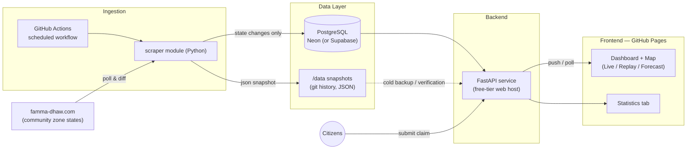
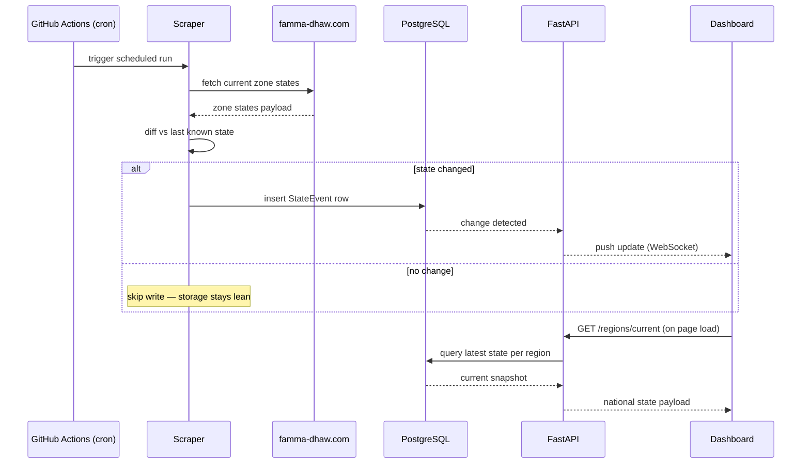

# Kahraba Live — Real-Time Tunisia Electricity Status Platform

**Project Specification, Architecture & Development Roadmap**

| | |
|---|---|
| **Status** | 📋 Planning — pre-development, no code written yet |
| **Version** | 0.1.0 (initial spec) |
| **Target repo** | `tunisianh/kahraba-live` (suggested — see [Open Decisions](#12-open-decisions--assumptions)) |
| **Hosting** | GitHub Pages (frontend) + GitHub Actions (ingestion) + one free-tier backend host |
| **Data source** | [famma-dhaw.com](https://famma-dhaw.com/) — community outage reports |
| **Languages** | العربية (Arabic) · Français · English |

> **How to use this document.** This is the project's founding brief — a `CONTEXT.md`-equivalent. It's written to sit alongside your usual multi-agent governance setup: treat the [Roadmap](#13-development-roadmap--tasks) as raw material for a hand-written `TASK.md`, not a replacement for it; point your `AGENTS.md` / `CLAUDE_RULES.md` at this file for project context; and consider freezing the [data model](#7-data-model) and the scraper's public interface into a `FROZEN_ZONES.md` entry once Phase 1 ships, since every later phase depends on those contracts staying stable.

---

## Table of Contents

1. [Executive Summary](#1-executive-summary)
2. [Background & Motivation](#2-background--motivation)
3. [Product Goals](#3-product-goals)
4. [Non-Goals](#4-non-goals)
5. [Personas & User Stories](#5-personas--user-stories)
6. [Functional Specification](#6-functional-specification)
7. [Data Model](#7-data-model)
8. [System Architecture](#8-system-architecture)
9. [Technology Stack](#9-technology-stack)
10. [Hosting & Deployment on Free Tiers](#10-hosting--deployment-on-free-tiers)
11. [The "Every 1 Second" Question — A Feasibility Note](#11-the-every-1-second-question--a-feasibility-note)
12. [Ethics, Data Sourcing & Legal Considerations](#12-open-decisions--assumptions)
13. [Development Roadmap & Tasks](#13-development-roadmap--tasks)
14. [Design Direction](#14-design-direction)
15. [Non-Functional Requirements](#15-non-functional-requirements)
16. [Repository Structure](#16-repository-structure)
17. [Risks & Mitigations](#17-risks--mitigations)
18. [Open Decisions & Assumptions](#12-open-decisions--assumptions)
19. [Future Ideas](#19-future-ideas)
20. [References & Data Sources](#20-references--data-sources)

---

## 1. Executive Summary

Tunisia's electricity grid has been under sustained strain, and STEG's official communications about which regions are affected are widely seen by the public as incomplete or contested. In response, an independent developer, Ghazi Ktata, launched **famma-dhaw.com** ("is there light?" in Tunisian dialect) — a free, login-less site where residents tap "on" or "off" for their zone, aggregated across roughly 296–298 tracked zones nationwide, refreshed every few seconds, with an explicit disclaimer that it is unofficial community data.

**Kahraba Live** (working title — *kahraba* = "electricity" in Arabic) is a companion platform that takes that same civic-transparency idea further:

- It **ingests** famma-dhaw's public zone-state data on a schedule.
- It **visualizes** it on an interactive OpenStreetMap-based map, live and in **replay** (any past date/time).
- It turns the underlying data into a **statistics** tool for journalists, researchers, and the public.
- It lets citizens **claim** their own region's state directly, with transparent on/off counts.
- It **estimates** future regional states from historical patterns.
- It ships in **Arabic, French, and English**, and is deployable entirely on free-tier infrastructure, with the frontend published on GitHub under the `tunisianh` account.

This document is the full specification: user stories, functional and technical specs, data model, architecture, a phased task roadmap, and — importantly — a set of honest feasibility notes on the parts of the brief (literal 1-second scraping, "free GitHub tier" for a real-time backend) that need a small amount of engineering judgment to reconcile with how free hosting actually works in mid-2026.

---

## 2. Background & Motivation

Summer 2026 brought a heatwave-driven surge in electricity demand across Tunisia, and with it, load-shedding (*délestage*) that disrupted work, study, and daily life in many regions. Public trust in STEG's outage communiqués has been strained enough that independent citizen-reporting tools have emerged to fill the information gap — famma-dhaw.com being the most visible one, built in days by a single developer and shared for free, no signup required.

famma-dhaw.com is explicit about what it is: **"Données communautaires non officielles · Croisez avec les communiqués STEG"** ("Unofficial community data — cross-reference with STEG announcements"). It aggregates one-tap reports into a rolling ~45-minute window per zone. That honesty about its own limits is worth preserving in Kahraba Live rather than papering over.

Kahraba Live's reason to exist alongside (not instead of) famma-dhaw.com is to add three things the source site doesn't offer today: a proper **geospatial map with time-travel (replay)**, a **statistics layer** for anyone who wants to analyze the crisis rather than just check their own street, and a **forecast** that turns raw history into a forward-looking signal. It should be positioned publicly as a complementary, attributed extension of the same civic effort — not a rebrand or a competitor.

---

## 3. Product Goals

Restating and organizing the brief:

1. **Ingest** live regional electricity-state data for the whole country from famma-dhaw.com.
2. **Publish** the app on GitHub under the free-tier account `tunisianh`.
3. **Trilingual** UI: Arabic (RTL), French, English.
4. **Welcome dashboard**: interactive OSM map of live regional states, plus **replay mode** (pick a past date/time and see the map as it was).
5. **Statistics tab**: a genuinely rich data surface — trends, rankings, distributions, export.
6. **Transparency counters**: show how many users claimed "on" vs "off" per region.
7. **Citizen claims**: a user can report their own region's state; that report becomes part of the record.
8. **Estimation tab**: forecast future regional states from history, shown on a map.

---

## 4. Non-Goals

Setting expectations explicitly, since this is a public-facing civic tool about a sensitive topic:

- **Not an official STEG product** and must never be presented as one. Every screen carries an "unofficial, community-sourced" disclaimer, mirroring famma-dhaw's own framing.
- **Not a guarantee of accuracy.** Crowdsourced and scraped data can be wrong, stale, or manipulated; the estimation tab is a probabilistic forecast, not a promise.
- **Not a replacement for emergency services or safety-critical use.** No one should make a safety-critical decision (medical equipment, etc.) based solely on this app.
- **Not collecting user accounts or PII** in v1 — matching famma-dhaw's own "no signup" ethos and keeping the abuse surface and privacy footprint small.
- **Not aiming for literal sub-second infrastructure in the MVP** — see [Section 11](#11-the-every-1-second-question--a-feasibility-note) for why, and what "real-time" means in practice here.

---

## 5. Personas & User Stories

### Persona A — Citizen Viewer (no account)
Wants to know their region's power status fast, in their preferred language, without friction.

| ID | User Story | Acceptance Notes |
|---|---|---|
| US-01 | As a citizen, I want to see my region's current electricity state on a map the moment I open the app, so I know what to expect without calling anyone. | Map + summary visible without login; state color-coded; "last updated Xs/min ago" always visible. |
| US-02 | As a citizen, I want to switch the UI between Arabic, French, and English, so I can use the app comfortably. | Language persists across sessions (local storage); Arabic renders full RTL layout, not just mirrored text. |
| US-03 | As a citizen planning to travel to charge a device, I want to see which nearby regions currently have power, so I know where to go. | Map supports pan/zoom/search by region name in all three languages. |
| US-04 | As a citizen, I want to scrub back to a specific past date and time, so I can see what the situation looked like then (e.g., yesterday's peak). | Replay timeline with date/time picker and play/pause; reconstructs full national state at time T. |
| US-05 | As a citizen unsure how reliable the shown state is, I want to see the raw on/off report counts for my region, not just a single verdict. | Counter widget shows both scraped-source counts and native claim counts, clearly labeled by origin. |

### Persona B — Citizen Contributor
Wants to report their own region's state in a few seconds, the way they already do on famma-dhaw.com.

| ID | User Story | Acceptance Notes |
|---|---|---|
| US-06 | As a resident, I want to report "on" or "off" for my region in one tap, with no account needed, so contributing costs me nothing. | Single-tap flow; region auto-suggested from geolocation if permitted, else searchable list. |
| US-07 | As a resident, I want confirmation that my report was recorded, so I trust it counted. | Toast/inline confirmation; visible tick-up of the relevant counter. |
| US-08 | As a resident, I don't want to see the data get spammed by one person tapping repeatedly, so the numbers stay meaningful. | Per-device/IP rate limit (e.g., one active claim per region per cooldown window); no account required to enforce it. |

### Persona C — Journalist / Researcher / Analyst
Wants the underlying data, not just a headline number.

| ID | User Story | Acceptance Notes |
|---|---|---|
| US-09 | As a journalist, I want historical outage statistics by governorate, so I can report on which regions are worst affected. | Sortable ranking table + charts; date-range filter. |
| US-10 | As a researcher, I want to export the underlying dataset as CSV/JSON, so I can run my own analysis. | Export endpoint with date-range + region filters; documented schema. |
| US-11 | As an analyst, I want a forecast of which regions are likely to see outages in the coming hours, so I can factor that into planning or reporting. | Estimation tab, horizon selector (e.g., +1h/+3h/+6h/+12h/+24h), confidence indicator. |

### Persona D — Maintainer (you)
Wants the thing to run itself, cheaply, and tell you when it breaks.

| ID | User Story | Acceptance Notes |
|---|---|---|
| US-12 | As the maintainer, I want the scraper to run on a schedule without manual intervention, so data stays fresh with no upkeep. | GitHub Actions cron + a redundant free-tier trigger (see [§10](#10-hosting--deployment-on-free-tiers)). |
| US-13 | As the maintainer, I want to be notified if scraping starts failing (e.g., source site changes its markup), so I can fix it before data goes stale. | Actions workflow fails loudly (GitHub notification) + a "data may be stale" banner surfaces automatically in the UI if no successful scrape lands within N minutes. |
| US-14 | As the maintainer, I want the whole stack running on free-tier services, so the project costs nothing to keep alive. | See [§10](#10-hosting--deployment-on-free-tiers) for the concrete free-tier plan and its actual limits. |

---

## 6. Functional Specification

### 6.1 Dashboard (Welcome Page)

- Full-bleed interactive map (Leaflet + OSM-based tiles) of Tunisia, regions colored by current state:
  - 🟢 On · 🔴 Off · 🟠 Mixed/uncertain signal · ⚪ No recent data
- A slim "pulse ribbon" above or below the map: % of tracked zones currently reporting off, national total, last-refresh timestamp, and a "data may be delayed" indicator if the ingestion pipeline hasn't run recently — the same honesty famma-dhaw.com itself shows with its "Hors ligne — données non actualisées" state.
- Clicking/tapping a region opens a detail panel: current state, on/off counts (scraped + native, labeled separately), a small history sparkline, and the "claim your region" action.
- A three-way **mode switch**: **Live / Replay / Forecast** — one map component, three data sources (see [§14](#14-design-direction) for why this is the visual signature element).
- A language switcher (AR / FR / EN), always visible.

### 6.2 Replay Mode

- Timeline scrubber plus an explicit date/time picker (for jumping straight to a moment, e.g., "yesterday 9pm").
- Play/pause animates the map forward through history at a configurable speed.
- Reconstructs the full national state as of timestamp T by taking, per region, the most recent state change at or before T (see the event-sourced model in [§7](#7-data-model) — this is what makes replay cheap to serve, since it's a single indexed query, not a giant table of per-second snapshots).

### 6.3 Statistics Tab

Concrete views to make this "a rich source of data," not just one chart:

- National outage rate over time (line chart).
- Per-governorate ranking, sortable, with a date-range filter.
- Outage duration distribution (histogram — how long outages typically last, per region and nationally).
- Hour-of-day × day-of-week heatmap (when outages cluster).
- Community engagement over time (claims submitted, most-active reporting regions) — this doubles as the transparency signal from Goal 6.
- Agreement/divergence rate between scraped famma-dhaw data and Kahraba Live's own native claims — a genuine data-quality metric, not vanity.
- CSV/JSON export with region + date-range filters.

### 6.4 Transparency Counters

- Per region, display both counts explicitly and separately:
  - "**N** reported ON · **M** reported OFF" (Kahraba Live's own claims, rolling window)
  - "Source: famma-dhaw.com — **X** reported ON · **Y** reported OFF" (scraped)
- Never collapse these into a single number without also showing the breakdown — the whole point of Goal 6 is that people can audit the claim, not just trust a verdict.

### 6.5 Citizen Claims

- One-tap "It's on" / "It's off" per region, no account.
- Lightweight anti-abuse: a device identifier (random UUID in local storage) + IP-based rate limiting; one active claim per region per cooldown window (e.g., 15–30 minutes) per device — tune based on observed abuse, not guessed upfront.
- Claims aggregate into a rolling window (configurable; famma-dhaw.com itself uses ~45 minutes as a reference point) and are combined with the scraped state using a simple, explainable rule (e.g., most-recent-wins with a minimum-corroboration threshold) rather than an opaque black-box merge — explainability matters more than sophistication here, since people will scrutinize a "your region says on but your neighbor says off" disagreement.

### 6.6 Estimation Tab

A phased approach — start simple, only add complexity once there's enough history to justify it:

- **Phase A (MVP):** a historical frequency table per region × weekday × hour (e.g., "Kairouan Nord is off 40% of the time on Tuesdays between 18:00–20:00"), recomputed daily. Pure `pandas` groupby — no ML library needed.
- **Phase B:** weight recent weeks more than older ones (grid conditions and season change), and — since these outages are demand/heat driven — pull a temperature forecast for each region and use "forecast heat" as a feature. This is the single highest-leverage improvement given *why* these outages are happening.
- **Phase C (stretch):** a proper per-region or pooled classifier (gradient boosting / logistic regression via scikit-learn), backtested against held-out history before it's trusted in production.
- Forecast is shown on the same map component (Forecast mode), colored by predicted state/probability, with a horizon selector and a persistent disclaimer: *"Estimated from historical patterns — not a guarantee. Always cross-check official STEG communications."*

### 6.7 Trilingual (AR / FR / EN)

- All UI strings, region names, and static content translated in all three languages; region names in particular need real Arabic/French/English forms (not transliteration guesses) — see the boundary-data sources in [§20](#20-references--data-sources) for datasets that already carry all three.
- Arabic renders true RTL: mirrored layout (not just right-aligned text), logical CSS properties, mirrored icons where directionality matters (e.g., back/forward arrows).
- Numbers, timestamps, and chart axes are a deliberate exception: keep them LTR even inside RTL layout, per standard bidi practice — this is what virtually every Arabic-language product does for time-series data, since "time flows left to right" is a stronger convention than reading direction for charts specifically.
- Chart library RTL support is inconsistent across the JS ecosystem — budget explicit time to test and, if needed, manually mirror chart containers rather than assuming it works out of the box.

### 6.8 Data Source: famma-dhaw.com Ingestion

- The site requires JavaScript to render its data (confirmed by inspection), so a plain HTTP GET will not expose the live zone states — Phase 0 must include inspecting the site's network requests (browser dev tools) to look for a direct JSON endpoint before assuming a headless-browser scraper (Playwright) is necessary. If a documented or reverse-engineered JSON endpoint exists, prefer it — it's lighter, faster, and far more stable than parsing rendered HTML.
- Poll on a schedule, but **only write to the database when a region's state actually changes** (diff against last known state). This isn't just etiquette — see the storage math in [§11](#11-the-every-1-second-question--a-feasibility-note).
- Treat famma-dhaw.com's own zone list (~296–298 zones, exact figure fluctuates) as the canonical `Region` reference list, since scraped data needs to map 1:1 onto it without ambiguity — reconcile zone names against a geographic boundary dataset for the map (see [§20](#20-references--data-sources)).

---

## 7. Data Model

Core entities (illustrative fields — refine during Phase 1 implementation):

**`Region`**
| Field | Type | Notes |
|---|---|---|
| `id` | string/slug | Stable identifier matching famma-dhaw's zone naming |
| `name_ar`, `name_fr`, `name_en` | string | Trilingual display names |
| `governorate` | string | Parent governorate, for statistics roll-ups |
| `geometry` | GeoJSON | Boundary or point, from boundary dataset |
| `centroid_lat`, `centroid_lon` | float | For map pin placement |

**`StateEvent`** (event-sourced — one row per *change*, not per poll)
| Field | Type | Notes |
|---|---|---|
| `id` | bigint | |
| `region_id` | FK → Region | |
| `state` | enum(on, off, mixed, unknown) | |
| `source` | enum(scraped, claim_aggregate) | |
| `changed_at` | timestamp | |
| `scrape_run_id` | FK → ScrapeRun, nullable | |

**`Claim`**
| Field | Type | Notes |
|---|---|---|
| `id` | bigint | |
| `region_id` | FK → Region | |
| `state` | enum(on, off) | |
| `device_id` | string (random UUID, no PII) | |
| `submitted_at` | timestamp | |
| `ip_hash` | string | Hashed, for rate-limiting only — never store raw IP long-term |

**`ScrapeRun`** (audit log)
| Field | Type | Notes |
|---|---|---|
| `id` | bigint | |
| `started_at`, `finished_at` | timestamp | |
| `status` | enum(ok, partial, failed) | |
| `regions_changed` | int | For monitoring/alerting |
| `error_detail` | text, nullable | |

**`EstimationResult`**
| Field | Type | Notes |
|---|---|---|
| `region_id` | FK → Region | |
| `horizon` | enum(1h, 3h, 6h, 12h, 24h) | |
| `predicted_state` | enum(on, off) | |
| `probability` | float | |
| `model_version` | string | |
| `computed_at` | timestamp | |

**Why event-sourced, not periodic snapshots:** with ~300 regions, storing a row per region *per second* is ~25.9 million rows/day (300 × 86,400) — at even ~50 bytes/row that's well over 1 GB/day, which blows through any free-tier database (typically 500 MB–1 GB total) in hours, not months. Storing a row only when a region's state actually *changes* — realistically a few state changes per region per day even during an active crisis — keeps the same table at a few hundred to a few thousand rows/day, sustainable indefinitely on a free tier, while still supporting exact-state-at-any-timestamp replay queries.

---

## 8. System Architecture





**Component summary:**
- **Ingestion** runs independently of the API's uptime — a GitHub Actions cron job (free, unlimited on a public repo) invokes the scraper directly against the database, so data keeps flowing even if the backend host is asleep/cold.
- **Data layer** is the source of truth for everything: live state, replay, statistics, and estimation all read from the same `StateEvent` log. The git-committed JSON snapshots are a free, permanent, human-readable backup independent of any third-party database's uptime or terms.
- **Backend** (FastAPI) serves the read APIs, accepts claims, computes/serves estimation results, and pushes live updates over WebSocket to connected dashboards.
- **Frontend** is a static React build on GitHub Pages — no server-side rendering needed, which is exactly what free static hosting wants.

---

## 9. Technology Stack

Chosen to match your existing full-stack experience (Java/Spring Boot, FastAPI, React, PostgreSQL) rather than introducing a new stack for a side project — Python covers scraping, backend, and the estimation tab's data work in one language.

| Layer | Choice | Why |
|---|---|---|
| Frontend | React + Vite | Static build output, perfect for GitHub Pages; matches your existing React experience |
| i18n | react-i18next | Mature AR/FR/EN support, RTL-aware |
| Map | Leaflet + react-leaflet, OSM-based tiles | No API key required for the library itself; see tile-provider note below |
| Charts | Recharts | Good React ergonomics for the statistics tab |
| Styling | Tailwind CSS | Utility-first, logical-property support for RTL |
| Backend | FastAPI (Python) | Matches your existing experience; async, native WebSocket support |
| ORM / DB | SQLAlchemy + PostgreSQL | Matches your existing experience |
| Scraper | Python (httpx, or Playwright if a headless browser proves necessary — see §6.8) | Shares code/models with the backend |
| Scheduling | GitHub Actions (cron) as primary; optional external cron pinger as backup trigger | Free and unlimited on a public repo |
| Realtime push | FastAPI WebSocket (Postgres LISTEN/NOTIFY or in-process pub/sub) | Keeps this logic in your own code rather than a vendor's proprietary realtime feature |

**Map tile provider note:** don't point production traffic at `tile.openstreetmap.org` directly — OSM's tile usage policy is meant for light/testing use, not sustained app traffic. Use a provider with a real free tier for OSM-based tiles (MapTiler and Stadia Maps both offer one) or self-host tiles later if usage grows.

---

## 10. Hosting & Deployment on Free Tiers

| Piece | Where | Notes |
|---|---|---|
| Frontend (React build) | **GitHub Pages**, `tunisianh` account | 100% static; deployed via a GitHub Actions build step |
| Scraper scheduling | **GitHub Actions** | Free & unlimited minutes on standard runners for public repos (private repos are capped, e.g. 2,000 min/month on the Free plan) — subject to GitHub's fair-use policy, which is why this should stay a scheduled job, not a tight always-on loop |
| Historical archive | **Git history** (`/data` snapshots committed by Actions) | Free, permanent, independent of any other service's uptime |
| Backend API (FastAPI) | A free-tier web-service host (e.g., Render's free web service) | Free compute sleeps after inactivity and cold-starts on the next request (tens of seconds) — acceptable since scheduled scraper traffic effectively keeps it warm |
| Database (PostgreSQL) | **Neon** (recommended) or Supabase | See comparison below — **do not use Render's free PostgreSQL** for this |

**Why not Render's free Postgres:** as of mid-2026, Render auto-deletes free-tier databases 30 days after creation. That's fine for a throwaway demo and actively wrong for a project whose entire value is historical continuity (replay, statistics, estimation). Use a database provider whose free tier persists indefinitely instead:

| Option | Persistence | Built-in realtime | Notes |
|---|---|---|---|
| **Neon** (recommended) | Yes — scales to zero, resumes in ~1s, data persists indefinitely | No (build push via FastAPI WebSocket) | Best fit here: fast resume, and the scraper's own regular writes keep it from ever truly idling |
| Supabase | Yes, but free projects **pause after 7 days with no API activity** (data preserved; needs a manual or automated resume) | Yes (Realtime channels) | Attractive if you'd rather not build push yourself — but riskier if the scraper job ever silently stops for a week+, since the whole app goes unreachable until someone manually resumes it |
| Render Postgres (free) | **No — deleted after 30 days** | N/A | Avoid for anything meant to persist |

Free-tier terms shift often (Render revised its pricing in April 2026; Supabase tightened its pause policy in February 2026) — re-verify current limits on each provider's own pricing page before committing, rather than trusting this table indefinitely.

---

## 11. The "Every 1 Second" Question — A Feasibility Note

Worth addressing directly rather than quietly working around: the brief asks for data refreshed every second, on GitHub's free tier. Two separate constraints make the literal version impractical, and there's a version that gets the *feel* the brief is actually after.

**Constraint 1 — GitHub Pages has no backend.** It serves static files only. There is no compute on GitHub Pages itself to run a per-second poller; that logic has to live in Actions (cron-scheduled, minute-level granularity at best, not seconds) or on a separate host entirely.

**Constraint 2 — storage.** As shown in [§7](#7-data-model), naively storing a state row per region every second produces on the order of a gigabyte a day — more than most free-tier database's *total* quota, consumed in hours.

**What actually gets you "real-time":**
1. The scraper polls the source at a moderate, source-respectful interval (recommend starting around every 1–5 minutes, tightening later only if there's a real reason to and the source can bear it).
2. Every write is delta-only (state-changed writes, not per-poll writes) — this is what keeps storage sustainable regardless of polling frequency.
3. The *frontend* feels live because the backend pushes updates over WebSocket the instant a change is detected and written — not because anything is literally being re-fetched every second. A user watching the dashboard sees their region flip within moments of the underlying change, which is what "real-time" means to someone actually using the app.
4. If literal per-second freshness from the source turns out to matter later, that's a job for a small always-on process outside GitHub's free tier entirely (e.g., a persistent lightweight worker), not something GitHub Pages/Actions can provide — worth revisiting only if the moderate interval proves genuinely insufficient in practice.

---

## 12. Ethics, Data Sourcing & Legal Considerations

famma-dhaw.com is itself a young, unofficial, single-developer civic project — not a corporation with infrastructure built for third-party load. A few things worth building in from day one rather than retrofitting:

- **Check `robots.txt` and any visible terms before scraping** — a Phase 0 task, not an afterthought.
- **Poll respectfully.** The moderate interval in §11 isn't just a technical constraint — hammering a small independent site's backend at high frequency risks degrading it for the citizens actually relying on it during outages, which would defeat the whole civic purpose of both projects.
- **Attribute clearly, everywhere derived data is shown** — "Source: famma-dhaw.com" should be as visible as the STEG-cross-reference disclaimer.
- **Consider reaching out to Ghazi Ktata directly** before building a scraper against his site — a data-sharing arrangement or an actual API would be more robust than reverse-engineering a frontend that could change at any time, and it's a healthier relationship between two people building complementary tools for the same crisis than an unannounced scraper would be.
- **Build resilience against losing scraping access entirely.** Because citizen claims (Goal 7) are already a first-class, independent data source in this design — not merely a supplement to the scrape — Kahraba Live keeps producing meaningful data even if the famma-dhaw.com scraper breaks or access is withdrawn.
- **Naming:** avoid branding the new app in a way that could read as impersonating or appropriating famma-dhaw.com's identity, given it belongs to an identified individual's named project. A distinct name (see [Open Decisions](#12-open-decisions--assumptions)) with clear, generous attribution is both the more respectful and the lower-risk choice.

---

## 13. Development Roadmap & Tasks

Phased so each phase is independently useful and unlocks the next. Check items off as you go — this section is meant to be edited over time (or fed into your own `TASK.md`).

### Phase 0 — Discovery & Foundations
- [ ] Inspect famma-dhaw.com's network requests (browser dev tools) for a direct JSON endpoint before assuming headless-browser scraping is required
- [ ] Check famma-dhaw.com `robots.txt` / any visible terms; note constraints
- [ ] (Recommended) Reach out to Ghazi Ktata about a data-sharing arrangement
- [ ] Adopt famma-dhaw's ~296–298 zones as the canonical `Region` list; source a matching GeoJSON boundary dataset and build a name-matching table (see [§20](#20-references--data-sources))
- [ ] Create the `tunisianh/kahraba-live` public repo
- [ ] Provision a Neon (or Supabase) Postgres project
- [ ] Provision a free-tier web-service host for FastAPI
- [ ] Pick and register a map tile provider (MapTiler / Stadia Maps free tier)

### Phase 1 — Core Data Pipeline
- [ ] Build the `scraper/` Python module: fetch → parse → diff → write-on-change
- [ ] Define `Region`, `StateEvent`, `ScrapeRun` models + migrations
- [ ] GitHub Actions workflow: scheduled scrape + commit JSON snapshot to `/data`
- [ ] Core FastAPI endpoints: `GET /regions`, `GET /regions/current`, `GET /regions/{id}/history`
- [ ] End-to-end smoke test: source → DB → API response

### Phase 2 — Dashboard MVP
- [ ] React + Vite scaffold, Tailwind setup
- [ ] react-i18next with `en`/`fr`/`ar` resources; RTL wired to `<html dir>`
- [ ] Live map (react-leaflet) colored by current state
- [ ] Pulse ribbon (live national summary + freshness indicator)
- [ ] Language switcher
- [ ] Deploy pipeline: Actions build → GitHub Pages (`tunisianh.github.io/kahraba-live`)

### Phase 3 — Replay Mode
- [ ] `GET /regions/state-at?timestamp=` (reconstruct state at time T)
- [ ] Timeline scrubber + date/time picker
- [ ] Play/pause animation
- [ ] Live / Replay / Forecast mode switch (Forecast wired up in Phase 6)

### Phase 4 — Claims & Transparency
- [ ] `Claim` model + device-id/rate-limit anti-abuse design
- [ ] `POST /claims` + aggregation logic (rolling window, explainable merge with scraped state)
- [ ] One-tap claim UI with confirmation
- [ ] Per-region transparency widget: scraped counts + native counts, labeled separately

### Phase 5 — Statistics Tab
- [ ] Aggregation queries (outage rate over time, per-governorate ranking, duration distribution, hour×weekday heatmap)
- [ ] Charts (Recharts)
- [ ] CSV/JSON export endpoint
- [ ] Claims-vs-scraped agreement metric

### Phase 6 — Estimation Tab
- [ ] Phase A model: historical frequency table (region × weekday × hour)
- [ ] `GET /estimate?horizon=` + scheduled daily recompute
- [ ] Forecast map view + confidence indicator + disclaimer banner
- [ ] Phase B (stretch): incorporate temperature/heatwave forecast as a feature
- [ ] Phase C (stretch): trained classifier, backtested against held-out history

### Phase 7 — Polish & Launch
- [ ] Accessibility pass (keyboard nav, contrast, screen-reader labels in all 3 languages)
- [ ] Low-bandwidth/performance pass (asset budget, lazy-loading; consider a PWA offline cache — relevant since people checking during an outage may be on mobile data with a low battery)
- [ ] Disclaimer footer on every page (unofficial data, cross-check STEG, attribution to famma-dhaw.com)
- [ ] README, CONTRIBUTING, LICENSE
- [ ] Launch checklist

**Current progress:** nothing built yet — Phase 0 has not started. Update this section (or your linked `SESSION_LOG.md`) as work lands.

---

## 14. Design Direction

Per your usual bar for a distinctive, non-templated look — not the cream/serif/terracotta or near-black/neon-accent defaults. A direction grounded in the actual subject: grid monitoring, status indicators, a crisis-transparency tool with Tunisian identity.

**Concept: "Grid Control Room."**

- **Palette:**
  - `#10161C` deep grid-night (base) — a blue-charcoal, not flat black
  - `#2FBF71` signal green (power on)
  - `#D9483C` signal clay-red (power off)
  - `#E8A33D` signal amber (mixed/uncertain — also nods to the heatwave context)
  - `#1B232B` surface (cards/panels)
  - `#EDEFF2` ink (text on dark)
  - `#3FD0C9` accent teal — reserved for brand/interactive elements only, never reused for state semantics
- **Type:** IBM Plex Sans + IBM Plex Sans Arabic for headings/UI (a genuine multi-script family designed together, not two mismatched fonts stitched together); IBM Plex Mono for data readouts (counts, timestamps, percentages) — evokes a meter/SCADA readout and gives numbers a distinct rhythm from prose.
- **Layout:** the map *is* the hero — no generic headline-plus-illustration above the fold. The pulse ribbon sits directly above it in monospace digits.
- **Signature element:** the Live/Replay/Forecast switch styled as a physical three-position rocker/breaker switch — on-theme (it's literally a switch, on an electricity app), memorable, and functional rather than decorative.
- **Restraint:** motion budget spent on one thing — a brief, subtle flicker/transition when a region's state flips on the live map. Everything else stays still and legible.

---

## 15. Non-Functional Requirements

- **Performance:** dashboard usable on a mid-range phone over 3G; keep initial JS payload small; lazy-load the statistics/estimation tabs.
- **Accessibility:** keyboard-navigable map controls, WCAG-AA contrast on all status colors (verify green/red/amber remain distinguishable for color-blind users — add a secondary shape/icon cue, not color alone), screen-reader labels in all three languages.
- **Privacy:** no accounts, no PII in v1; device IDs are random and local; IPs are hashed and only used transiently for rate-limiting, never stored raw long-term.
- **Security:** rate-limit the claims endpoint; validate/sanitize all inputs; CORS locked to the known frontend origin.
- **Resilience:** a visible "data may be stale" state if ingestion hasn't succeeded recently, rather than silently showing outdated information as current.
- **Internationalization:** all three languages ship complete at launch — no language treated as an afterthought fallback.

---

## 16. Repository Structure

```
kahraba-live/
├── frontend/                 # React + Vite app
│   ├── src/
│   │   ├── components/       # Map, Ribbon, Switch, Charts, ClaimButton...
│   │   ├── i18n/              # en.json, fr.json, ar.json
│   │   └── ...
├── backend/                  # FastAPI app
│   ├── app/
│   │   ├── models.py          # SQLAlchemy models
│   │   ├── routers/           # regions, claims, stats, estimate
│   │   └── ws.py               # WebSocket push
├── scraper/                  # Shared scraper module (used by Actions + backend)
│   ├── fetch.py
│   ├── diff.py
│   └── store.py
├── estimation/                # Estimation models (pandas/scikit-learn)
├── data/                      # Git-scraped JSON snapshots (historical archive)
├── .github/
│   └── workflows/
│       ├── scrape.yml          # Scheduled ingestion
│       ├── deploy-pages.yml    # Build + deploy frontend
│       └── ci.yml               # Lint/test
├── docs/
│   └── kahraba-live-spec.md    # This document
└── README.md
```

---

## 17. Risks & Mitigations

| Risk | Impact | Mitigation |
|---|---|---|
| famma-dhaw.com changes its frontend structure, breaking the scraper | Data goes stale | Prefer a discovered JSON endpoint over HTML parsing; alert on scrape failure; native claims (Goal 7) provide an independent fallback data source |
| Free-tier hosting terms change or a service is discontinued | Downtime / data loss | Git-committed snapshots are a permanent, vendor-independent backup; pick a DB provider (Neon) that doesn't hard-delete data |
| Claim spam/abuse skews transparency counters | Misleading data | Device-id + rate limiting from day one; keep the merge rule explainable so anomalies are visible, not hidden |
| Estimation tab creates false confidence | Real-world harm if someone relies on a wrong forecast | Persistent, unavoidable disclaimer; show confidence/probability, not a bare verdict; start with a simple, auditable model before anything opaque |
| Being mistaken for an official STEG channel | Reputational/trust risk for the whole project | Disclaimer on every page; clear visual distinction from any official styling |
| Scraping viewed as unwelcome by famma-dhaw.com's creator | Relationship/access risk | Reach out proactively (§12); rate-limit respectfully regardless of response |

---

## 18. Open Decisions & Assumptions

Everything below was decided by default to keep this spec concrete and complete — revisit any of these freely:

- **Working name:** "Kahraba Live" is a suggested placeholder, chosen to be trilingual-friendly and distinct from famma-dhaw's own branding. Not final.
- **Zone granularity:** assumed to mirror famma-dhaw's own ~296–298 zones (roughly delegation-level, not the 24 top-level governorates) so scraped data maps 1:1. Confirm the exact figure and granularity once the source is inspected directly.
- **Database:** Neon recommended over Supabase over self-hosted; revisit if built-in auth/storage/realtime bundling ends up mattering more than avoided lock-in.
- **Backend host:** Render's free web service assumed as the default; Fly.io is a reasonable alternative if Render's cold-start behavior proves too disruptive.
- **Polling interval:** 1–5 minutes assumed as the respectful default, against the brief's literal "every 1 second" — see [§11](#11-the-every-1-second-question--a-feasibility-note) for the full reasoning.
- **Claims cooldown window:** 15–30 minutes assumed; tune against observed abuse rather than deciding upfront.
- **No user accounts in v1:** assumed, to match famma-dhaw's own frictionless ethos and minimize the privacy/abuse surface.

---

## 19. Future Ideas

Stretch goals, not commitments:

- **PWA / offline mode:** cache last-known state so the dashboard is still useful with no connectivity — directly relevant given the use case (checking during an outage).
- **SMS/USSD fallback:** a way to check/report status without a smartphone or data connection, for exactly the moments this app matters most.
- **Push notifications:** opt-in alert when a followed region's state changes.
- **Official STEG data integration:** if an official feed or API ever becomes available, integrate it as a labeled, separate signal alongside (not replacing) the community data.
- **Public API:** let other developers build on top of Kahraba Live's aggregated dataset, the way this project builds on famma-dhaw.com's.

---

## 20. References & Data Sources

- **Data source:** [famma-dhaw.com](https://famma-dhaw.com/)
- **Coverage on famma-dhaw.com's launch and purpose:** [L'instant M](https://linstant-m.tn/single-article/ar10714_famma-dhaw-un-jeune-tunisien-cree-la-carte-citoyenne-des-coupures-electricite), [webdo.tn](https://www.webdo.tn/fr/actualite/national/face-aux-communiques-contestes-de-la-steg-fama-dhaw-com-cartographie-les-coupures-en-direct/401470/)
- **Tunisia administrative boundaries (GeoJSON/shapefiles, trilingual name fields):**
  - [jmgclark/tunisia_shapefiles](https://github.com/jmgclark/tunisia_shapefiles) — governorates/delegations/municipalities with Arabic + English name fields
  - [mtimet/tnacmaps](https://github.com/mtimet/tnacmaps) — governorates, delegations, circonscriptions as GeoJSON/TopoJSON
  - [OussamaNairi/List-of-Tunisian-Governorates-and-Delegations-and-Municipality](https://github.com/OussamaNairi/List-of-Tunisian-Governorates-and-Delegations-and-Municipality) — CSV in Arabic/French/English
  - [Humanitarian Data Exchange — Tunisia subnational boundaries](https://data.humdata.org/dataset/geoboundaries-admin-boundaries-for-tunisia) — standard `geoBoundaries` GeoJSON
- **Infrastructure docs to re-verify before committing:** GitHub Actions billing (docs.github.com), Render pricing (render.com/pricing), Supabase pricing (supabase.com/pricing), Neon pricing (neon.tech) — all confirmed current as of July 2026 in this document, but free-tier terms change without much notice.

---

*End of specification. This is a living document — update the Roadmap and Progress sections as phases complete, and revisit the Open Decisions section as choices firm up.*
